# README.md
- [English](readme/README.en.md)
- [简体中文](README.md)

最近更新：
2024年6月8日，更新简要：整合多个版本无线网卡，增加仿冒显卡支持

文档版本号：v1.0.0u01-d01

------------------------------------------------------

# 目录

1. [主板型号](#1主板型号)

    1.1. [EFI支持的macOS版本](#11EFI支持的macOS版本)
    
2. [使用教程](#2使用教程)

    2.1. [设置bios](#21设置BIOS)
    
    2.2. [配置三码信息](#22配置三码信息)
    
3. [更新记录](#3更新记录)
4. [已知问题](#4已知问题)
5. [macOS关于](#5macOS关于)
6. [相关资源](#6相关资源)

    6.1. [macOS升级包下载](#61macOS升级包下载)
    
    6.2. [macOS 13.5.1 镜像包下载](#62macOS-13.5.1-镜像包下载)
    
    6.3. [推荐使用的系统](#63推荐使用的系统)
    
    6.4. [避免使用的版本](#64避免使用的版本)
    
    6.5. [如何升级版本](#65如何升级版本)
    
7. [展示的使用信息](#7展示的使用信息)
8. [其他](#8其他)
9. [疑难解答](#9疑难解答)
10. [鸣谢](#10鸣谢)

------------------------------------------------------

# 1.主板型号

支持主板型号：
1. TX GAMING B760M WIFI D4
2. TX GAMING B760M WIFI D5

关键字：`华硕天选B760M黑苹果`，`TX B760m Hackintosh`，`TX GAMING B760M WIFI hackintosh`， `TX GAMING B760M WIFI D4`, `TX GAMING B760M WIFI D5`, `TX GAMING B760M 黑苹果`；

## 1.1.EFI支持的macOS版本

    EFI对Wi-Fi驱动程序进行了相关整合，根据内核版本控制驱动加载，集成到一个EFI可直接安装12-14区间版本
    
    EFI支持：macOS 12 - macOS 14.5（截稿最新）
    
    本EFI会跟随系统随时更新，尽情留意。

------------------------------------------------------

# 2.使用教程

## 2.1.设置BIOS

⚠️ 在配置BIOS时，建议将bios恢复成出厂设置，再行设置

|BIOS菜单路径| Bios选项名          | 选项      | 必需 |
|-----------|--------------------|----------|------|
|           | VT-d               | Enabled  |      |
|           | XHCI-Hand-Off      | Enabled  |      |
|           | Above 4G Decoding  | Enabled  |      |
|           | Fast Boot          | Disabled |      |
|           | CSM                | Disabled |      |
|           | Secure Boot        | Disabled |      |
|           | Resize Bar Support | Enabled  |      |

## 2.2.配置三码信息

配置三码信息可用以下工具进行三选一（点击进入到相关软件下载）：
1. [OCAuxiliaryTools](https://github.com/ic005k/OCAuxiliaryTools/releases)
2. [opencore-configurator](https://mackie100projects.altervista.org/opencore-configurator/)
3. [Hackintool](https://github.com/benbaker76/Hackintool)

#### [🔔在本项目文件中的 tools文件中有修改三码的工具下载(点我进入)](tools/)

### 1.通过 [OCAuxiliaryTools](https://github.com/ic005k/OCAuxiliaryTools/releases) 工具 打开 config文件后，进入到 PI 后，生成三码信息导入使用
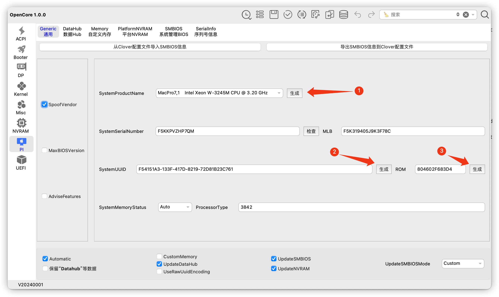

### 2.使用 opencore configurator 修改三码信息也同样可以
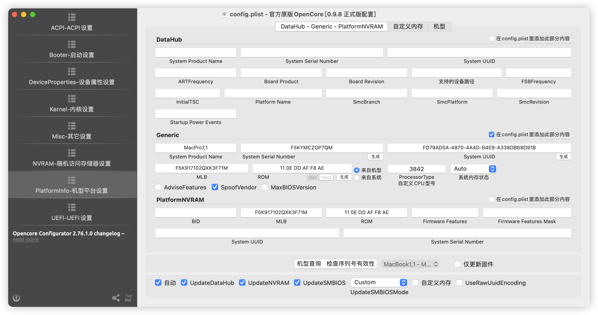

### 3.通过 hackintool 工具也可以生成三码信息

------------------------------------------------------

# 3.更新记录

## 2024-06-08 更新
2024-06-08 更新说明
1，增加多个网卡驱动，支持在不同系统下均能使用无线网卡
2，完善到opencore 1.0.0 版本
3，改进显卡支持，仿冒6650xt与6690xt由用户自行购选
4，增加多个调试和最新驱动工具

## 2024-05-17 更新
1. 原生本机Wifi，蓝牙支持
2. 更新到opencore 1.0.0
3. 支持最新 macOS 14.5版本
4. EFI文件归类，不同系统根据分类使用
5. 支持Apple DRM（支持无损格式，杜比）

## 2023-4-30 更新
1. 加入大小核心调度，能够正确识别大核，线程，小核，不会启动应用直接全部占用
   系统优先使用大核，其次小核，再线程
1. 直接调用的主板自带因特尔网卡，支持Wi-Fi 6，不需要额外购买网卡
2. 如果是免驱显卡可以去掉 6650xt的acpi，如果是仿冒其他驱动，第一插槽的显卡地址为：pc00/peg1
3. 有线网卡速率2.5G
4. 去除usb端口限制
5. 已屏蔽核显，核显无法驱动，屏蔽后可以节能
6. 睡眠唤醒正常使用
7. 大小核补丁加入后，性能比未加入的要高很多
8. 声音，麦克风正常使用

------------------------------------------------------

# 4.已知问题
~~1. 自带蓝牙目前没有驱动 已解决~~

2，不能随航（需要该功能可以买免驱动网卡，14已不支持原有博通直接免驱）

------------------------------------------------------

# 5.macOS关于
<table>
    <tr>
        <td>
            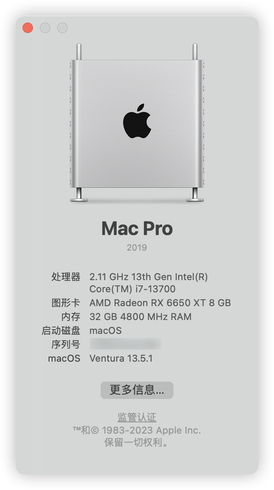
<!--            EFI：macOS-Ventura/EFI
             
            升级：小版本直接升级，大版本升级到14.3.1最高
             
            ⚠️需要将无线网卡升级到14.0版本-->
        </td>
        <td>
            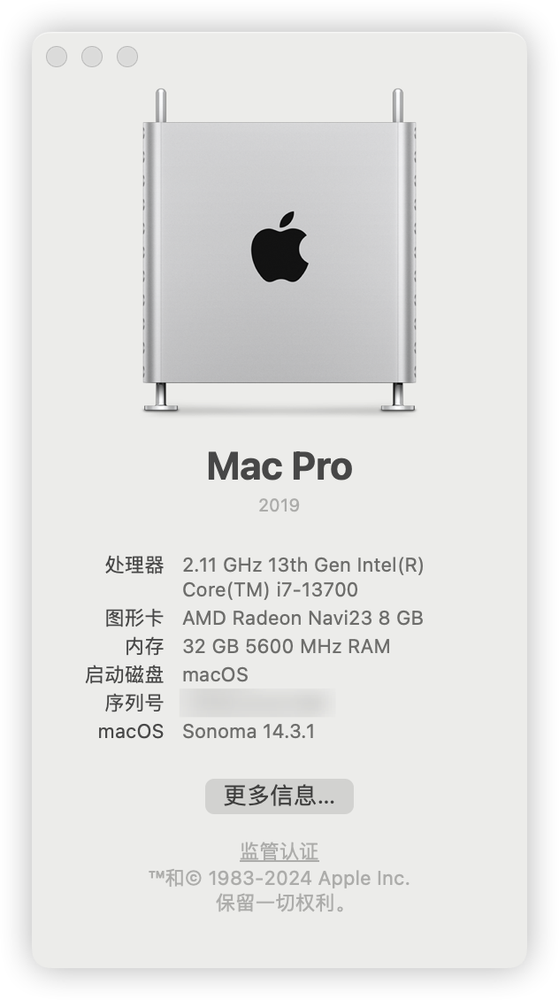
<!--            EFI：macOS-Sonoma-14.3.1up/EFI
             
            升级：14.0 - 14.3.1 之间任意版本使用，蓝牙以及无线已经更新到14.0版本
             
            ⚠️升级14.4以及以上版本需配置EFI：·Misc - Security - SecurityBootMode : Disabled·
             
            ⚠️需要将无线网卡升级到14.4版本-->
        </td>
        <td>
            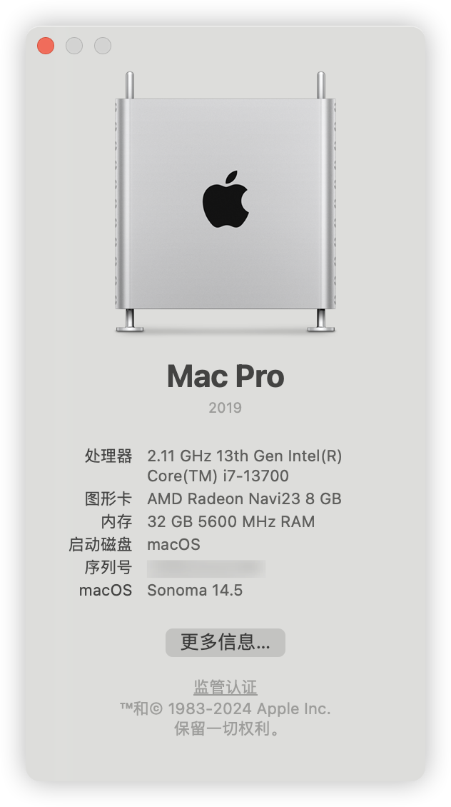
           <!-- EFI：macOS-Sonoma-14.4/EFI
             
            14.4-目前最新版本14.5之间版本可以任意升级，已经更新了蓝牙和无线网卡驱动到最新版本，并且已经处理好SecurityBootMode，更新nvmefix支持到14.5-->
        </td>
    </tr>
</table>

------------------------------------------------------

# 6.相关资源

## 6.1.macOS升级包下载

* macOS Sonoma 14.5 (23F79) - 推荐版本
 
    链接: https://pan.baidu.com/s/1DQ9vFTQPSUv7Xg-wMDT6hg?pwd=4qxa 

    提取码: 4qxa 

    SHA256SUM：包内

* macOS Sonoma 14.3.1 (23D60)
 
    链接: https://pan.baidu.com/s/1_bTx8A4GdBfaLCLUEh4YzA?pwd=bt4j

    提取码: bt4j 

    SHA256SUM：包内

## 6.2.macOS 13.5.1 镜像包下载

* macOS Venture 13.5.1 22G90 With opencore 0.9.4 and WinPE

    链接: https://pan.baidu.com/s/1rq-Q5e3-my8gZUX3oZS_Ng?pwd=rv49 

    提取码: rv49 

## 6.3.推荐使用的系统

1. Ventura 13.5.1(有小版本更新直接升级)
2. Sonoma 14.3.1
3. Sonoma 14.5

## 6.4.避免使用的版本

1. macOS 14.4.1 ： [包含 Java 代码的某些应用程序会意外退出｜影响icoud｜生产力不推荐]

## 6.5.如何升级版本

1. 小版本升级：可以直接在系统设置 直接更新
2. 大版本升级 推荐：使用 pkg 对应版本的升级包升级
3. 大版本升级：下载对应 dmg 系统包，打开以后有一个安装进行升级

------------------------------------------------------

# 7.展示的使用信息

1. 主板自带网卡驱动信息
因 Sonoma 14 以后，免驱动苹果网卡无法使用，且只支持Wi-Fi5，使用Wi-Fi 6 自带网卡速率更快

内置无线网卡可以跑满 2400Mbps传输速率
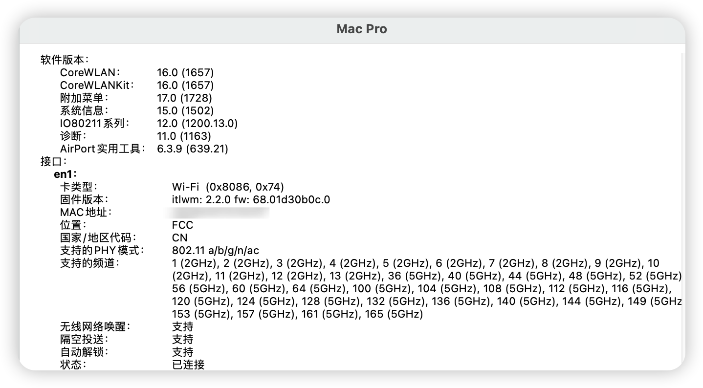
2. cpu核心能够正确识别成 16核心 24个线程（大核心，小核心，线程。其他处理器同样支持）
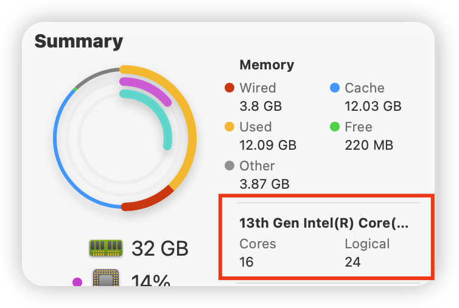
大小核处理器均能识别到正确的大小核并且调度
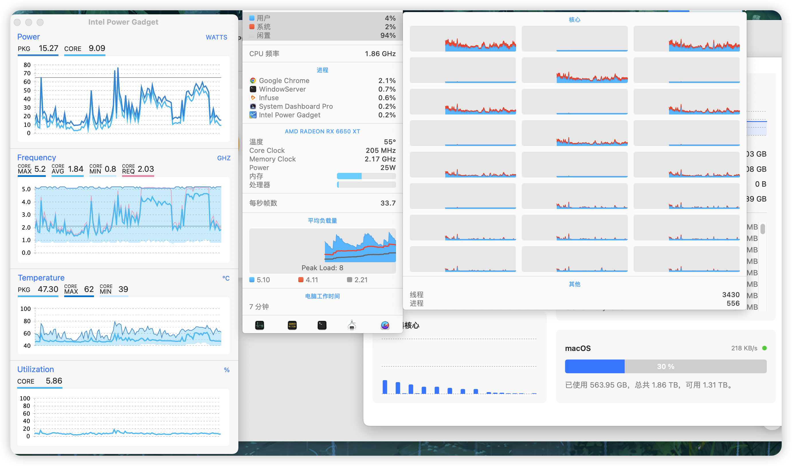

3. 将 音乐 - 设置 - 播放，流播放：设置成无损
出现无损标志：支持Apple DRM

4. 日常使用占用
双屏4k，播放影音以及日常办公使用
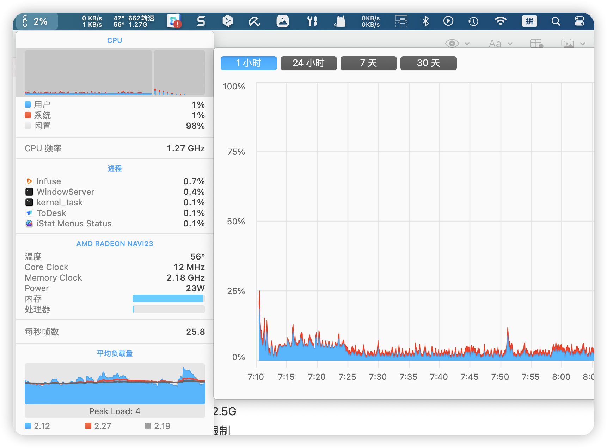

-------------------------------

# 8.其他

1. opencore 1.0.0 支持多个版本的无线网卡驱动（通过内核版本控制驱动加载方式制作）
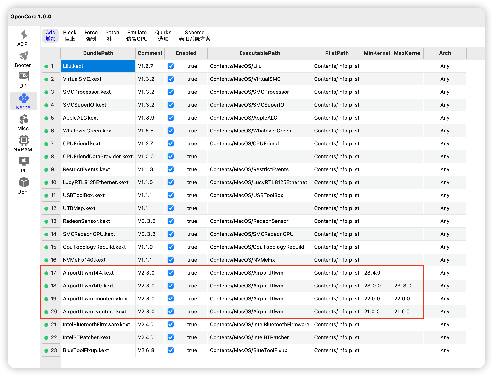

macOS 14.4 内核起步版本：23.3.0 (因14.4无线网卡驱动需要另外部署)
macOS 14.0 内核起步版本：23.0.0 
macOS 13 内核起步版本：22.0.0
macOS 12 内核起步版本：21.0.0

2. ACPI信息，增加支持 `RX6650XT` 与 `TX6690XT` 显卡的仿冒支持
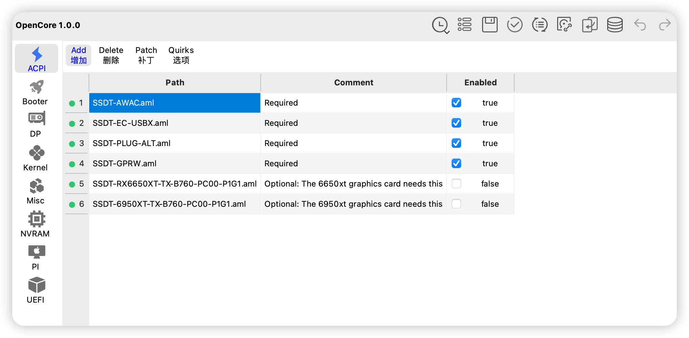
默认是不启动仿冒显卡支持，如果你的显卡是 `RX6650XT` `TX6950XT`，请根据你的显卡进行购选启用（Enabled勾选即可）

3. 版本验证 opencore 1.0.0
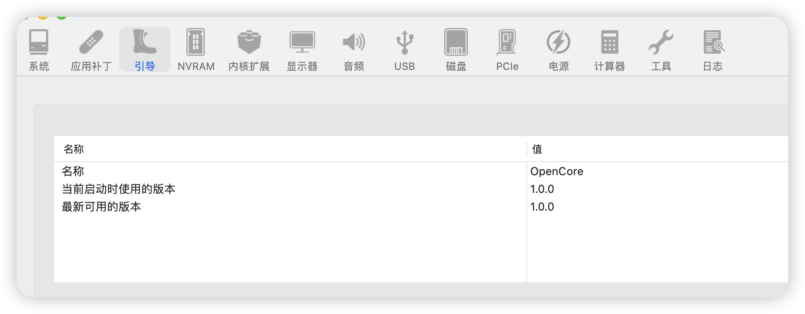

4. 驱动加载情况
 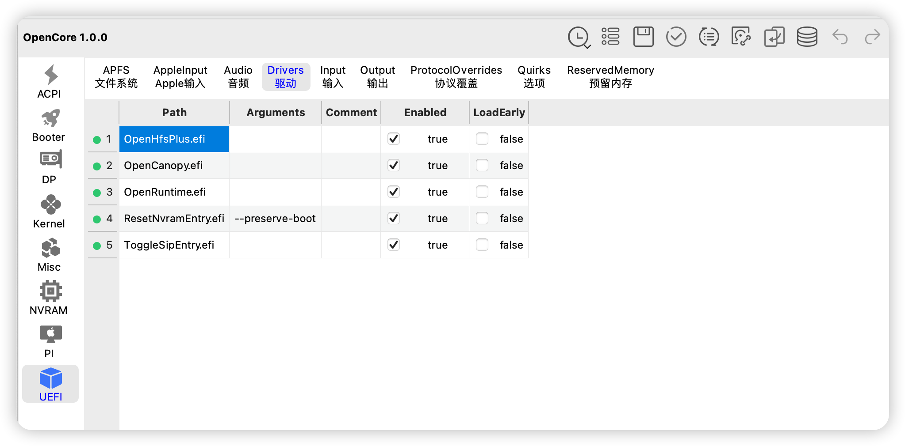
 
5. 睡眠信息
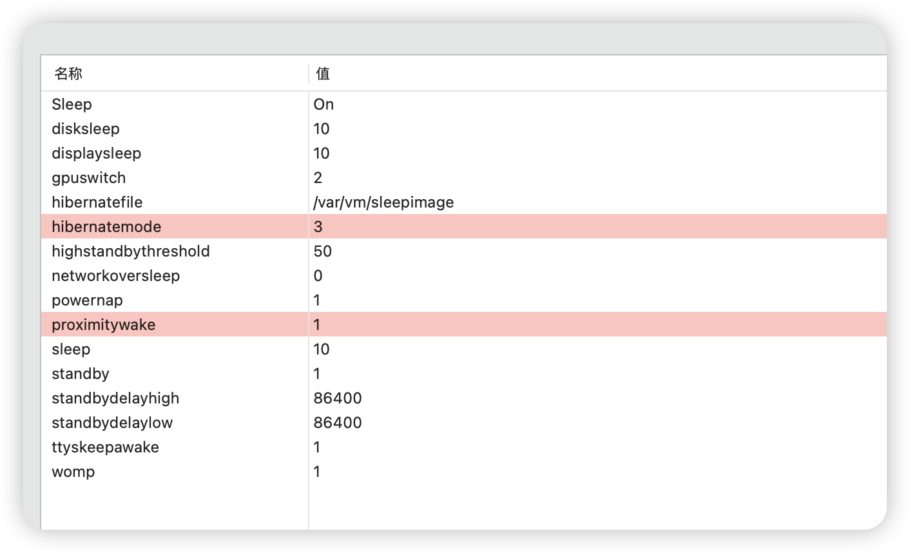

6. 保留仿冒显卡改名
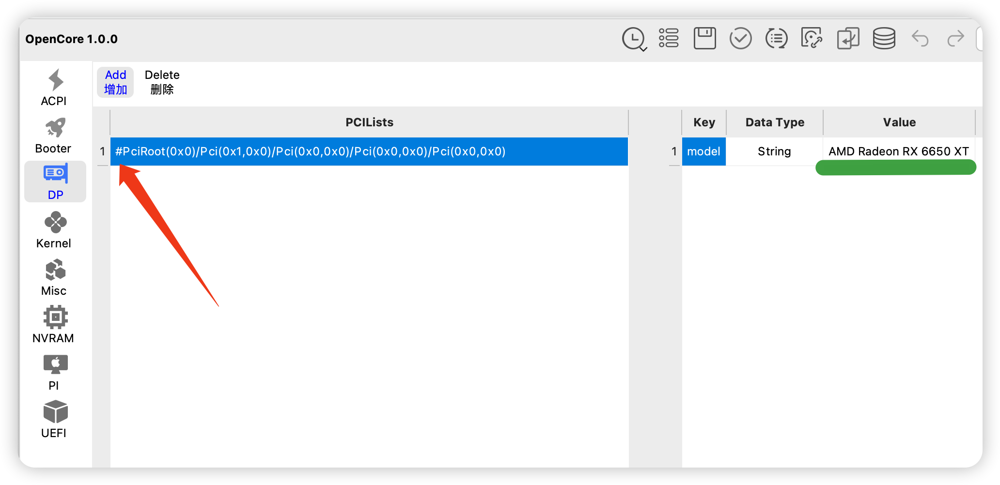
将第一个箭头的 # 号去掉以后，可以将Value的名称改成你需要的显卡名

# 9.疑难解答
### 为什么里面参数的序列是反过来的，比如我们看到的 11 22 33，输入到系统要变成 33 22 11 ？
这是因为目前主流的操作系统都采用: 小端模式
> 参考：大端模式（big-endian）与小端模式（little-endian）

# 10.鸣谢
1. [opencore](https://github.com/acidanthera/OpenCorePkg)
2. [Acidanthera and all kext developer for hackintosh](https://github.com/acidanthera)
3. [OCAuxiliaryTools](https://github.com/ic005k/OCAuxiliaryTools/releases)
4. [itlwm](https://github.com/OpenIntelWireless/itlwm)
5. [CpuTopologyRebuild](https://github.com/b00t0x/CpuTopologyRebuild)
6. [LucyRTL8125Ethernet](https://github.com/Mieze/LucyRTL8125Ethernet)
7. [Hackintool](https://github.com/benbaker76/Hackintool)
8. [opencore-configurator](https://mackie100projects.altervista.org/opencore-configurator/)