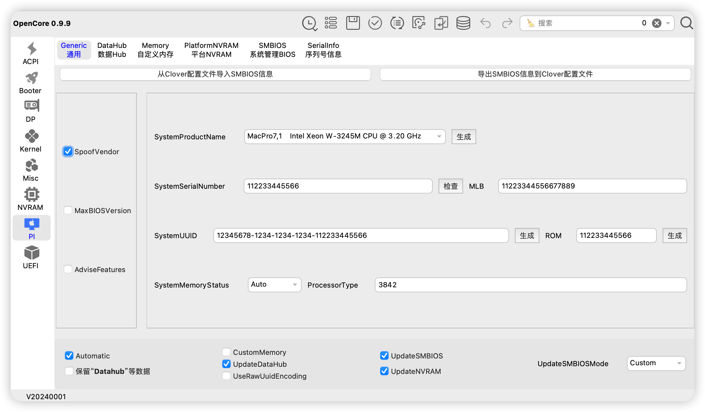

# 主板型号
TX GAMING B760M，EFI支持 ddr4/ddr5版本

## opencore : 0.9.9 版本

## 支持系统：
1. macOS Sonoma 14
2. macOS Ventura 13
3. macOS Monterey 12

## 更新 2023.4.30：
1. 加入大小核心调度，能够正确识别大核，线程，小核，不会启动应用直接全部占用
   系统优先使用大核，其次小核，再线程
2. 直接调用的主板自带因特尔网卡，支持Wi-Fi 6，不需要额外购买网卡
3. 如果是免驱显卡可以去掉 6650xt的acpi，如果是仿冒其他驱动，第一插槽的显卡地址为：pc00/peg1
4. 有线网卡速率2.5G
5. 去除usb端口限制
6. 已屏蔽核显，核显无法驱动，屏蔽后可以节能
7. 睡眠唤醒正常使用
8. 大小核补丁加入后，性能比未加入的要高很多
9. 声音，麦克风正常使用

## 已知问题：
1. 自带蓝牙目前没有驱动

##### ⚠️ 除该问题外，其他已经正常使用

## bios设置
  VT-d ：Enabled		
  XHCI-Hand-Off ：Enabled
  Above 4G Decoding ： Enabled		
  Fast Boot	： Disabled
  CSM	： Disabled		
  Secure Boot ： Disabled
  Resize Bar Support	： Enabled

## 加载 kext 信息

## 使用教程：
通过 [OCAuxiliaryTools](https://github.com/ic005k/OCAuxiliaryTools/releases) 工具 打开 菜单 PI 后，生成三码信息导入使用

## 其他

1. 主板自带网卡驱动信息
因 Sonoma 14 以后，免驱动苹果网卡无法使用，且只支持Wi-Fi5，使用Wi-Fi 6 自带网卡速率更快

内置无线网卡可以跑满 2400Mbps传输速率

2. ACPI信息
如果你是免驱动显卡，可以去掉 SSDT-RX6650XT-TXB760-PC00-PEG1.aml 文件
如果你是仿冒显卡，不同型号，可以使用hackintosh工具中的pcie找到显卡路径

3. cpu核心能够正确识别成 16核心 24个线程

大小核处理器均能识别到正确的大小核并且调度

以13700为例，前16个线程为大核+超线程，后8个为小核心。
1，3，5，7，9，11，13，15，为大核心
2，4，6，8，10，12，14，16，为超线程
17，18，19，20，21，22，23，24，为小核