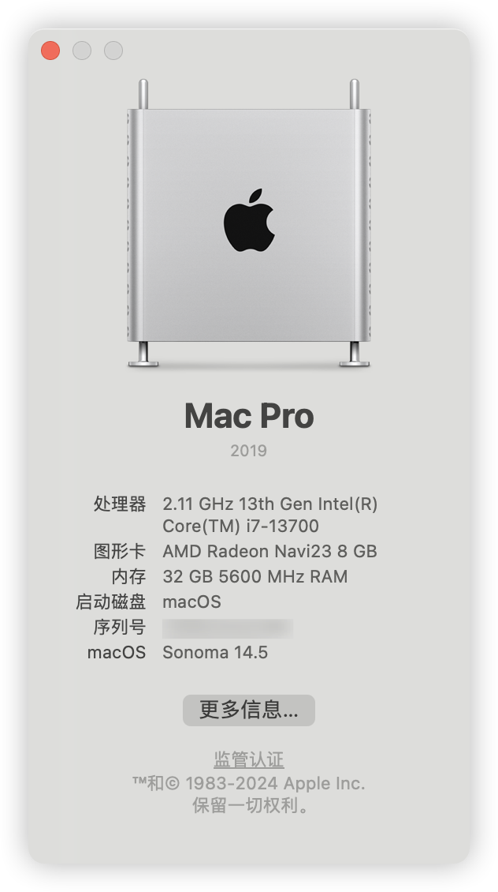
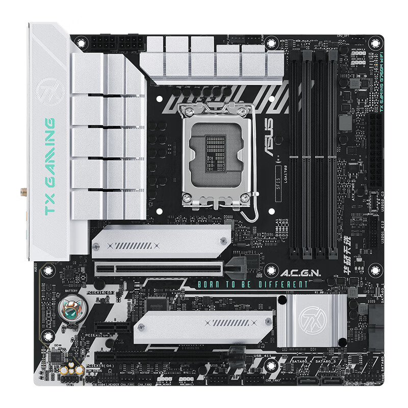
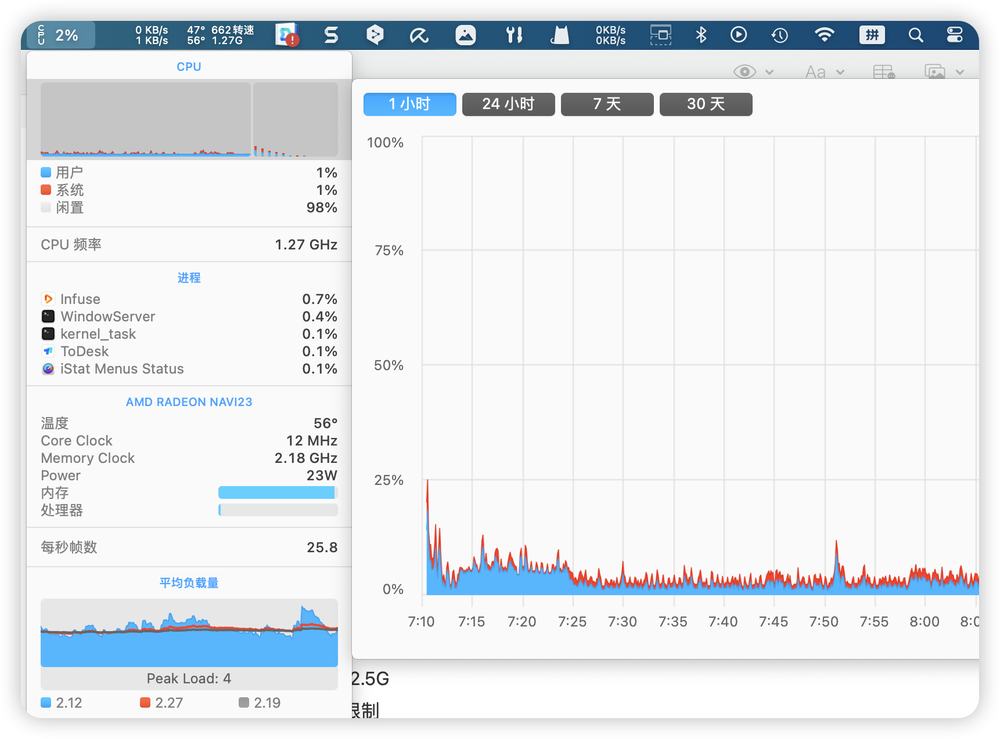

# README.md
- [English](readme/README.en.md)
- [简体中文](README.md)

Feel free to correct me if the description is incorrect.

# 目录
[Updated Description](#Updated-Description)

[EFI Files Description](#EFI-Files-Description)

[macOS About](#macOS-About)

[Motherboard Model](#Motherboard-Model)

[Guidelines for use](#Guidelines%20for%20use)

[Others](#Others)

[Solution Difficulties](#Solution-Difficulties)

[Acknowledgement](#Acknowledgement)

# Updated Description
#### 2024-05-17 Update
1. Native Wifi, Bluetooth support.
2. updated to opencore 1.0.0
3. Support the latest macOS 14.5.
4. EFI file classification, different systems according to the classification of use
5. Support Apple DRM (support lossless format, Dolby)

#### 2023-4-30 Update
1. Add large and small core scheduling, can correctly identify large cores, threads, small cores, will not start the application directly all occupied
   The system prioritises the use of large cores, followed by small cores and then threads.
1. directly call the motherboard comes with Intel network card, support Wi-Fi 6, do not need to buy an additional network card
2. if it is a driverless(No need for additional drivers) graphics card can remove the 6650xt acpi, if it is imitation of other drivers, the first slot of the graphics card address: pc00/peg1
3. wired network card rate 2.5G
4. remove usb port restriction
5. shielded nuclear display, nuclear display can not be driven, after shielding can be energy-saving
6. Wake from sleep works normally
7. after adding small and large core patch, the performance is much higher than that of the unadded one.
8. sound, microphone normal use

##### Known Issues:
~~1. There is no driver for Bluetooth at the moment Solved~~

2, can not follow the flight (need the function can buy driver-free network card, 14 no longer support direct driver-free)

# EFI Files Description
    
    macOS 12 - 13 Version： macOS-Ventura 

    macOS 14.1 - 14.3.1 Version：macOS-Sonoma-14.3.1up 

    macOS 14.4 - up Version：macOS-Sonoma-14.4 

#### Description
Due to changes related to macOS 14.4, you can't upgrade directly and painlessly

This configuration needs to be modified for macOS14.4 and higher ： 
Misc - Security - SecurityBootMode : Disabled

The wireless card driver will also need to be redeployed (the EFI currently made is ready to go straight away)

# macOS About
<table>
    <tr>
        <td>
            
<!--            EFI：macOS-Ventura/EFI
             
            升级：小版本直接升级，大版本升级到14.3.1最高
             
            ⚠️需要将无线网卡升级到14.0版本-->
        </td>
        <td>
            
<!--            EFI：macOS-Sonoma-14.3.1up/EFI
             
            升级：14.0 - 14.3.1 之间任意版本使用，蓝牙以及无线已经更新到14.0版本
             
            ⚠️升级14.4以及以上版本需配置EFI：·Misc - Security - SecurityBootMode : Disabled·
             
            ⚠️需要将无线网卡升级到14.4版本-->
        </td>
        <td>
            
           <!-- EFI：macOS-Sonoma-14.4/EFI
             
            14.4-目前最新版本14.5之间版本可以任意升级，已经更新了蓝牙和无线网卡驱动到最新版本，并且已经处理好SecurityBootMode，更新nvmefix支持到14.5-->
        </td>
    </tr>
</table>

##### ⚠️macOS versions that should be avoided
1. macOS 14.4.1 ： [Some applications containing Java code may quit unexpectedly｜It affects icoud｜Productivity is not recommended]

##### 🔝Recommended system version：
1. Ventura 13.5.1((There are minor version updates to upgrade directly))
2. Sonoma 14.3.1
3. Sonoma 14.5

##### ⏩How to upgrade :
1. Minor version upgrade: You can update directly in the system settings.
2. Major version upgrade: Use the pkg package to upgrade.
3. Major version upgrade: Download the corresponding dmg package, open it and there is an installation to upgrade.

# Motherboard Model
TX GAMING B760M, EFI support for ddr4/ddr5 versions

Keywords：`TX B760m Hackintosh`，`TX GAMING B760M WIFI hackintosh`；

## opencore : 1.0.0v2 144 Wireless Bluetooth card version

## opencore : 0.9.9 Version

## Supported MacOS：
1. macOS Soname 14.4 -> latest
1. macOS Sonoma 14.0 -> 14.3.1
2. macOS Ventura 13.0 -> 13.latest
3. macOS Monterey 12.0 -> 12.latest

# Guidelines for use
Opening the EFI config file through [OCAuxiliaryTools](https://github.com/ic005k/OCAuxiliaryTools/releases), generate SMI codes after click the PI.

## BIOS Settings
 
| BIOS Option Name   | options  | required |
|--------------------|----------|----------|
| VT-d               | Enabled  |          |
| XHCI-Hand-Off      | Enabled  |          |
| Above 4G Decoding  | Enabled  |          |
| Fast Boot          | Disabled |          |
| CSM                | Disabled |          |
| Secure Boot        | Disabled |          |
| Resize Bar Support | Enabled  |          |

## Others

1. The motherboard comes with a network card driver information
Due to Sonoma 14 onwards, the driver-free Apple NIC cannot be used and only supports Wi-Fi 5, using Wi-Fi 6 with its own NIC will result in faster rates.

The built-in wireless card can run at full 2400Mbps transfer rate.

2. ACPI Information
If you have a driver-free card, you can remove the SSDT-RX6650XT-TXB760-PC00-PEG1.aml file.
If you have a counterfeit graphics card, different model, you can use pcie in hackintosh tools to find the path to the graphics card

3. The cpu cores are correctly recognised as 16 cores 24 threads (big cores, small cores, threads. Other processors are also supported)

Both small and large processors recognise the correct size cores and schedule them.

4. Set Music - Settings - Playback, Streaming: to Lossless
Lossless logo appears: Apple DRM support

5. Daily use occupancy
Dual screen 4k, playback of video and audio and office use status

# Solution Difficulties
### Why is the sequence of parameters in there reversed, for example, if we see 11 22 33, the input to the system is going to be 33 22 11?
This is due to the fact that the dominant operating systems today use the: little-endian
> refer：big-endian and little-endian
> 

# Acknowledgement
1. [opencore](https://github.com/acidanthera/OpenCorePkg)
2. [Acidanthera and all kext developer for hackintosh](https://github.com/acidanthera)
3. [OCAuxiliaryTools](https://github.com/ic005k/OCAuxiliaryTools/releases)
4. [itlwm](https://github.com/OpenIntelWireless/itlwm)
5. [CpuTopologyRebuild](https://github.com/b00t0x/CpuTopologyRebuild)
6. [LucyRTL8125Ethernet](https://github.com/Mieze/LucyRTL8125Ethernet)